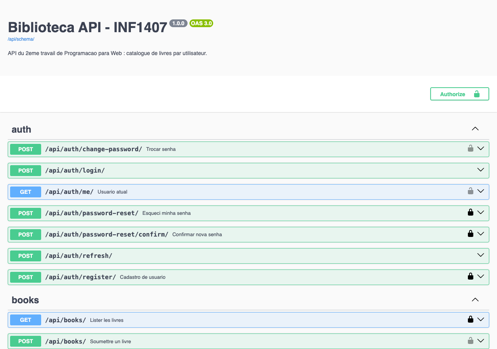
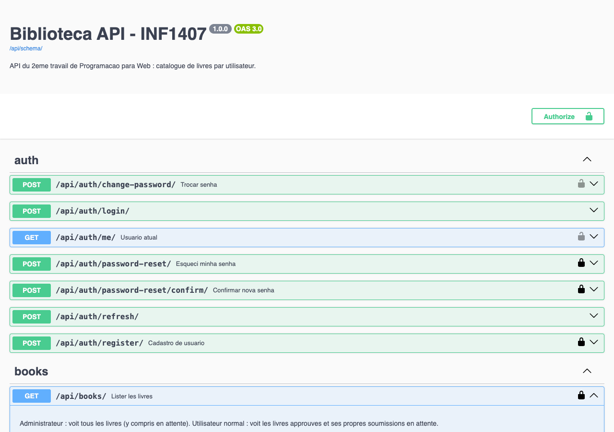
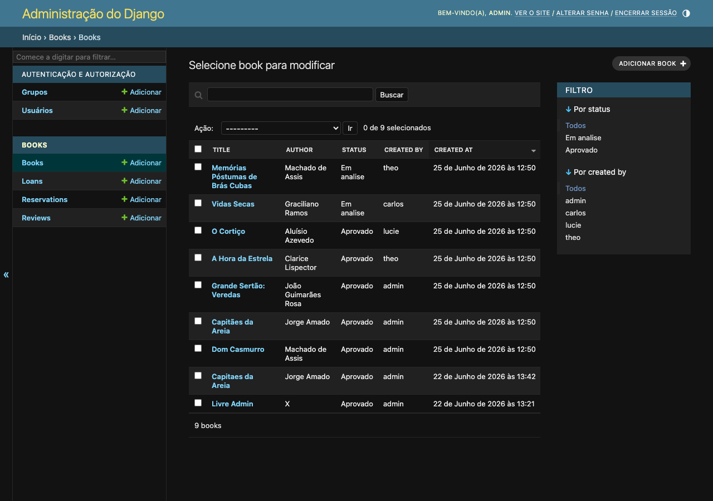

# 📚 Biblioteca Comunitária — Backend (INF1407)

Backend do **2º Trabalho de Programação para Web**. API REST desenvolvida em
**Django + Django REST Framework** para uma **biblioteca comunitária**:
administradores cadastram livros, usuários comuns sugerem livros (que precisam
ser aprovados), todos podem avaliar, emprestar e reservar.

🔗 **API online:** https://inf1407-biblioteca-api.onrender.com
🔗 **Documentação Swagger:** https://inf1407-biblioteca-api.onrender.com/api/docs/
🔗 **Repositório do frontend:** https://github.com/lemairetheo/INF1407_Trab2_Frontend

## 👥 Integrantes

* Théo Lemaire
* Lucie Brunelle

---

## 🎯 Escopo

API com autenticação JWT e dois perfis de usuário:

* **Administrador (staff):** cadastra livros já aprovados, aprova as sugestões,
  remove qualquer avaliação e enxerga todos os empréstimos/reservas.
* **Usuário comum:** sugere livros (ficam *pendentes* até a aprovação), avalia,
  empresta e reserva; enxerga só o aprovado + suas próprias sugestões.

### Funcionalidades

* **CRUD** de livros (`/api/books/`) — endpoint protegido (somente autenticado).
* **Leitura pública** do catálogo aprovado (visitantes, sem login).
* **Moderação** — livros de usuários comuns ficam `pending` até
  `POST /api/books/{id}/approve/` (somente admin).
* **Avaliações** (`/api/reviews/`) — qualquer usuário avalia; autor ou admin remove.
* **Empréstimos e reservas** (`/api/loans/`, `/api/reservations/`) — com fila de
  espera e controle de exemplares.
* **Autenticação JWT** — login e refresh de token.
* **Gerência de usuário** — cadastro, troca de senha, "esqueci minha senha".
* **Documentação Swagger** em `/api/docs/`.

---

## 🖥️ Capturas de tela

### Documentação Swagger

*A documentação interativa da API em `/api/docs/`, com os grupos de endpoints
(auth, books, reviews, loans, reservations).*

### Endpoint detalhado no Swagger

*O endpoint `/api/books/` expandido, com parâmetros e respostas documentados.*

### Painel administrativo do Django

*O Django Admin com a lista de livros e a coluna de status (pending/approved).*

---

## ⚙️ Tecnologias

* Python 3.11 / Django 4.2
* Django REST Framework
* drf-spectacular (Swagger / OpenAPI)
* djangorestframework-simplejwt (JWT)
* django-cors-headers (CORS)
* PostgreSQL (produção) / SQLite (desenvolvimento)
* Hospedagem: **Render**

## 🚀 Instalação local

```bash
# 1. Clonar
git clone https://github.com/lemairetheo/INF1407_Trab2_Backend.git
cd INF1407_Trab2_Backend

# 2. Ambiente virtual
python3 -m venv venv
source venv/bin/activate        # Windows: venv\Scripts\activate

# 3. Dependências
pip install -r requirements.txt

# 4. Variáveis de ambiente
cp .env.example .env            # ajuste se necessário

# 5. Banco de dados + dados de exemplo
python manage.py migrate
python manage.py seed           # popula com usuários, livros, avaliações...
python manage.py createsuperuser

# 6. Rodar o servidor
python manage.py runserver      # http://localhost:8000
```

## 📡 Endpoints principais

| Método | Rota | Descrição | Auth |
|--------|------|-----------|------|
| POST | `/api/auth/register/` | Cadastro de usuário | Não |
| POST | `/api/auth/login/` | Login (retorna JWT) | Não |
| POST | `/api/auth/refresh/` | Renova o token | Não |
| GET | `/api/auth/me/` | Dados do usuário atual | Sim |
| POST | `/api/auth/change-password/` | Troca de senha | Sim |
| POST | `/api/auth/password-reset/` | Solicita reset por email | Não |
| GET/POST | `/api/books/` | Lista / cria (ou sugere) livros | Lista: não / Cria: sim |
| GET/PUT/DELETE | `/api/books/{id}/` | Detalha / edita / remove | Sim (dono ou admin) |
| POST | `/api/books/{id}/approve/` | Aprova um livro pendente | Sim (admin) |
| GET/POST | `/api/reviews/` | Lista (`?book=<id>`) / cria avaliação | Lista: não / Cria: sim |
| GET | `/api/loans/` | Lista empréstimos | Sim |
| POST | `/api/loans/{id}/...` | Empréstimo / devolução | Sim |
| GET/POST | `/api/reservations/` | Reservas | Sim |
| GET | `/api/docs/` | Documentação Swagger | Não |

### Contas de teste (após `seed`)

| Usuário | Senha | Perfil |
|---------|-------|--------|
| `admin` | (definida no deploy) | Administrador |
| `theo` / `lucie` / `carlos` | `Senha12345` | Usuário comum |

---

## ✅ Relato — o que funciona / o que não funciona

**Funciona (testado):**

* CRUD completo de livros, com fluxo de moderação (pendente → aprovado).
* Autenticação JWT e endpoint protegido (401 sem token).
* Leitura pública do catálogo aprovado.
* Avaliações, empréstimos, devoluções e reservas com fila de espera.
* Visões diferentes por perfil (admin x usuário comum).
* Gerência de senha (troca e recuperação por email).
* Documentação Swagger sem erros de geração.
* Deploy no Render com PostgreSQL e seed automático.

**Limitações conhecidas:**

* O plano gratuito do Render **"dorme" após 15 minutos** de inatividade; o
  primeiro acesso pode demorar ~30–50 s para responder.
* Emails de redefinição de senha vão para a **sandbox do Mailtrap** (não chegam
  a uma caixa real) — comportamento esperado para avaliação.
